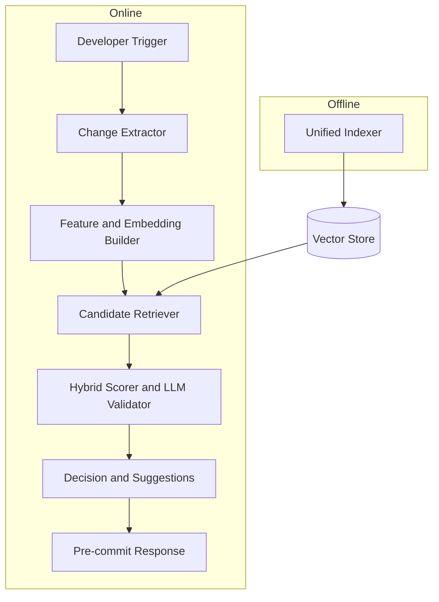
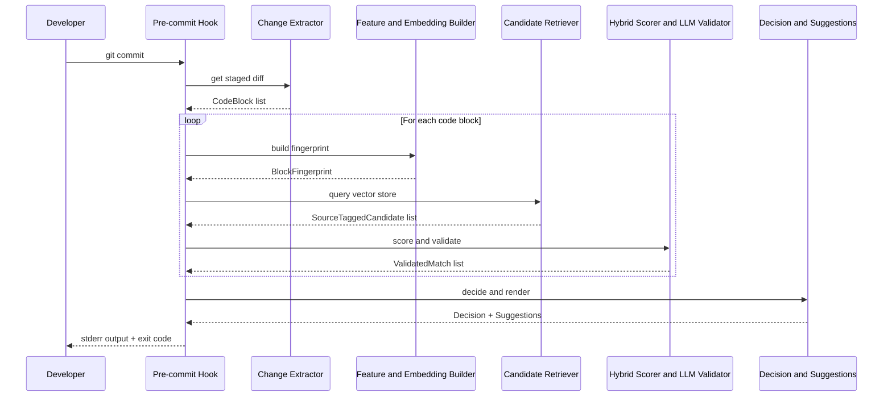

# Design Document: Common Library Reuse Detection

## Overview

This feature provides an agent-driven workflow that detects duplicate or reusable code **before the developer commits** their changes. It runs as a pre-commit hook (and also as a PR review step) so a developer is stopped from committing code that duplicates logic already available in the common library.

When triggered, the agent analyzes the staged/changed code and compares it against two sources: (1) common libraries hosted on GitHub, and (2) the rest of the microservice codebase. It uses a layered pipeline that combines AST structural analysis, semantic embeddings, vector search, and an LLM validation layer to find matches that go beyond simple text comparison.

The pipeline performs two types of checks:

- **Logic check** (behavior/intent): determines whether the staged code is behaviorally redundant with existing code, even if written differently.
- **Similarity check** (structure/tokens): determines whether the staged code structurally or token-wise duplicates existing code.

**Primary trigger is pre-commit.** The pipeline runs locally as a git pre-commit hook on the staged diff, and a second time as a CI/PR check on the merge-base diff. Duplicated code is caught and blocked BEFORE the commit lands. If the decision is `block`, the pre-commit hook exits non-zero and git aborts the commit.

## Architecture

The pipeline has **7 online stages** that run synchronously on every pre-commit, plus **1 offline indexer** that populates the vector store in the background.



### Stage Responsibilities

| # | Stage | Input | Output | Responsibility |
|---|-------|-------|--------|----------------|
| 1 | Developer Trigger | git pre-commit hook invocation | `TriggerEvent` | Kicks off the pipeline on staged diff |
| 2 | Change Extractor | `git diff --staged` | `list[CodeBlock]` | Parses diff, expands to whole functions/classes, drops trivial blocks, normalizes source |
| 3 | Feature and Embedding Builder | `CodeBlock` | `BlockFingerprint` | Single AST walk + single embedding call per block; produces AST features AND dense embedding in one object |
| 4 | Candidate Retriever | `BlockFingerprint` | `list[SourceTaggedCandidate]` | One ANN query against the unified source-tagged vector store; returns candidates from LOCAL and GITHUB together |
| 5 | Hybrid Scorer and LLM Validator | `BlockFingerprint` + top-K candidates | `list[ValidatedMatch]` | Computes structural similarity, embedding cosine, and LLM logic-equivalence check; emits combined score |
| 6 | Decision and Suggestions | `list[ValidatedMatch]` | `Decision` + `list[ReuseSuggestion]` | Deterministic thresholding into pass/warn/block; renders import line + usage snippet |
| 7 | Pre-commit Response | decision + suggestions | process exit code + stderr message | Writes suggestions to stderr; exits non-zero on block so git aborts the commit |
| Offline | Unified Indexer | GitHub repo list + local repo root | `BlockFingerprint` rows in vector store | Sole writer to the unified store; fetches GitHub libs and walks local code; tags rows LOCAL or GITHUB |

### How Both Checks Are Covered

| Check Type | What it detects | Where it runs |
|---|---|---|
| Logic check (behavior/intent) | Whether the staged block is behaviorally redundant with a candidate, even if written differently | LLM logic-equivalence component inside stage 5 |
| Similarity check (structure/tokens) | Whether the staged block structurally or token-wise duplicates a candidate | AST and embedding components across stages 3, 4, and 5 |

Both checks feed the same `ValidatedMatch`, which is the single input to the decision stage.

### How Both Sources Are Covered

The Unified Indexer tags every row in the vector store with its source (`LOCAL` or `GITHUB`). Stage 4 issues one ANN query with `sources=[LOCAL, GITHUB]` and gets a mixed candidate list back. No second query, no separate fusion step.

## Sequence Diagram



## Components and Interfaces

### CodeBlock and ChangeExtractor (Stage 2)

```python
from dataclasses import dataclass, field
from enum import Enum
from pathlib import Path


class ChangeType(Enum):
    ADDED = "added"
    MODIFIED = "modified"


@dataclass
class CodeBlock:
    """A discrete unit of code that can be analyzed for reuse."""
    file_path: Path
    start_line: int
    end_line: int
    content: str
    change_type: ChangeType
    function_name: str | None = None
    class_name: str | None = None


class ChangeExtractor:
    """Parses git diff, expands to whole functions/classes, normalizes source."""

    def extract(self, base_ref: str = "HEAD") -> list[CodeBlock]:
        """Extract all meaningful code blocks from the staged diff."""
        ...

    def is_trivial(self, block: CodeBlock) -> bool:
        """Return True if block is too small or comments-only."""
        ...
```

### BlockFingerprint and FeatureEmbeddingBuilder (Stage 3)

```python
import ast
from dataclasses import dataclass, field


@dataclass
class CodeFeatures:
    """Structural features extracted from a code block."""
    function_signatures: list[str] = field(default_factory=list)
    class_hierarchy: list[str] = field(default_factory=list)
    import_patterns: list[str] = field(default_factory=list)
    decorators: list[str] = field(default_factory=list)
    control_flow_pattern: str = ""
    parameter_types: list[str] = field(default_factory=list)
    return_type: str | None = None
    docstring: str | None = None
    ast_structure_hash: str = ""
    token_sequence: list[str] = field(default_factory=list)


@dataclass
class CodeEmbedding:
    """Dense semantic vector for a code block."""
    vector: list[float]
    dim: int
    model_id: str


@dataclass
class BlockFingerprint:
    """AST features AND dense embedding for a single CodeBlock."""
    block: CodeBlock
    features: CodeFeatures
    embedding: CodeEmbedding
    content_hash: str


class FeatureEmbeddingBuilder:
    """Single-pass builder: one AST walk + one embedding call per block."""

    def build(self, block: CodeBlock) -> BlockFingerprint:
        """Normalize, parse once, extract features, embed, return fingerprint."""
        ...

    def build_batch(self, blocks: list[CodeBlock]) -> list[BlockFingerprint]:
        """Batched variant for the offline indexer path."""
        ...
```

### CandidateRetriever (Stage 4)

```python
from dataclasses import dataclass
from enum import Enum


class IndexSource(Enum):
    GITHUB_LIBRARY = "github_library"
    LOCAL_CODEBASE = "local_codebase"


@dataclass
class SourceTaggedCandidate:
    """An ANN hit carrying its source tag."""
    source: IndexSource
    indexed_id: str
    distance: float
    fingerprint: BlockFingerprint


class CandidateRetriever:
    """Single ANN query against the unified source-tagged vector store."""

    def query(
        self,
        fp: BlockFingerprint,
        sources: list[IndexSource] = (IndexSource.LOCAL_CODEBASE, IndexSource.GITHUB_LIBRARY),
        top_k: int = 50,
    ) -> list[SourceTaggedCandidate]:
        """Return top_k candidates from ALL requested sources in one call."""
        ...
```

### HybridScorerLLMValidator (Stage 5)

```python
from dataclasses import dataclass


@dataclass
class ValidatedMatch:
    """A candidate after scoring and LLM validation."""
    source: IndexSource
    indexed_id: str
    structural_score: float
    semantic_score: float
    llm_confidence: float
    combined_score: float
    llm_rationale: str
    import_path: str
    existing_code: str


class HybridScorerLLMValidator:
    """Computes AST + embedding cosine + LLM logic-equivalence in one pass."""

    def score_and_validate(
        self, fp: BlockFingerprint, candidates: list[SourceTaggedCandidate]
    ) -> list[ValidatedMatch]:
        """For each candidate: structural score, semantic score, LLM logic check.
        Emit ValidatedMatch with a combined score."""
        ...
```

### DecisionRenderer (Stage 6)

```python
from dataclasses import dataclass
from enum import Enum


class Decision(Enum):
    PASS = "pass"
    WARN = "warn"
    BLOCK = "block"


@dataclass
class ReuseSuggestion:
    """A suggestion to reuse existing code."""
    original_code_location: str
    existing_code_location: str
    import_statement: str
    usage_example: str
    confidence: float
    explanation: str
    diff_preview: str


class DecisionRenderer:
    """Deterministic thresholding + suggestion rendering."""

    def __init__(self, block_threshold: float = 0.85, warn_threshold: float = 0.70):
        self.block_threshold = block_threshold
        self.warn_threshold = warn_threshold

    def decide_and_render(
        self, block: CodeBlock, validated: list[ValidatedMatch]
    ) -> tuple[Decision, list[ReuseSuggestion]]:
        """Apply thresholds to produce a Decision and render suggestions."""
        ...
```

### PrecommitResponse (Stage 7)

```python
class PrecommitResponse:
    """Writes output and controls the exit code."""

    def respond(self, decision: Decision, suggestions: list[ReuseSuggestion]) -> int:
        """Write suggestions to stderr. Return 0 on pass/warn, non-zero on block."""
        ...
```

### UnifiedIndexer (Offline)

```python
from pathlib import Path


class UnifiedIndexer:
    """Sole writer to the unified source-tagged vector store.

    Fetches configured GitHub common libraries, walks the local microservice
    repo, builds a BlockFingerprint per function/class, and upserts rows
    tagged LOCAL or GITHUB.

    Runs on install, on a schedule, and incrementally on local repo change.
    """

    def __init__(self, builder: FeatureEmbeddingBuilder, store_path: Path):
        self.builder = builder
        self.store_path = store_path

    def reindex_github(self, repositories: list[str]) -> int:
        """Fetch/refresh GitHub repos and upsert fingerprints with source=GITHUB."""
        ...

    def reindex_local(self, repo_root: Path) -> int:
        """Walk local microservice repo and upsert fingerprints with source=LOCAL."""
        ...

    def reindex_incremental_local(self, changed_paths: list[Path]) -> int:
        """Upsert only fingerprints for changed local files."""
        ...
```

## Pre-commit Integration

The hook is installed via the repo's pre-commit config and invokes a thin CLI entry point (`reuse-detect --staged`). That entry point:

1. Runs stages 1-7 synchronously on the staged diff only.
2. If `decision == BLOCK`, writes a human-readable message to stderr listing the top suggestions and exits with a non-zero code. Git aborts the commit.
3. If `decision == WARN` or `PASS`, exits 0 and the commit proceeds.

The same CLI is invoked in CI on the PR's diff against the merge-base. On `BLOCK` the CI job fails and posts a PR comment with the suggestions.

## Dependency-Gated Library Indexing

The system only checks common libraries for reusable code **if the library is declared as a dependency in `pyproject.toml`**. If a common library is not present in the project's Poetry dependencies, it is excluded from reuse detection entirely.

### Rationale

There is no point suggesting code reuse from a library the project cannot import. If `pdt-common` is not in `[tool.poetry.dependencies]`, then the developer cannot use any code from `pdt-common-lib`, so scanning it would produce unusable suggestions.

### How It Works

1. On pipeline startup, the `DependencyChecker` reads `pyproject.toml` and extracts all declared dependencies (from `[tool.poetry.dependencies]`, `[tool.poetry.dev-dependencies]`, Poetry groups, and PEP 621 sections).
2. Each configured GitHub repository is checked against the dependency set using `filter_indexable_repos`.
3. Only repositories whose package name matches a declared dependency are indexed and scanned for reuse candidates.
4. Repositories that do not match any dependency are skipped — no indexing, no scanning, no suggestions.

### Matching Rules

The matcher supports a `-lib` suffix convention common in internal repositories:

| Configured Repo | pyproject.toml Dependency | Match? | Reason |
|---|---|---|---|
| `pdt-common-lib` | `pdt-common` | ✅ Yes | Strips `-lib` suffix → `pdt-common` found in dependencies |
| `pdt-common-lib` | *(not listed)* | ❌ No | Neither `pdt-common-lib` nor `pdt-common` in dependencies |
| `some-other-lib` | *(not listed)* | ❌ No | Not a project dependency; skipped entirely |
| `my-utils` | `my-utils` | ✅ Yes | Direct name match |

### Example

Given this `pyproject.toml`:

```toml
[tool.poetry.dependencies]
pdt-common = {version = "0.5.1", source = "nexus"}
```

And this configuration with multiple common libraries:

```yaml
github_repositories:
  - url: "https://github.com/org/pdt-common-lib"
    package_name: "pdt-common-lib"
  - url: "https://github.com/org/pdt-analytics-lib"
    package_name: "pdt-analytics-lib"
```

**Result:** Only `pdt-common-lib` is indexed and checked for reusable code, because `pdt-common` is in the dependencies. `pdt-analytics-lib` is skipped because neither `pdt-analytics-lib` nor `pdt-analytics` appears in `pyproject.toml`.

## Configuration

```python
from dataclasses import dataclass, field
from pathlib import Path


@dataclass
class DetectionConfig:
    """Configuration for the reuse detection system."""
    github_repositories: list[str] = field(default_factory=list)
    similarity_threshold: float = 0.75
    block_threshold: float = 0.85
    warn_threshold: float = 0.70
    min_block_lines: int = 3
    cache_dir: Path = Path(".reuse-cache")
    index_refresh_interval_hours: int = 24
    exclude_patterns: list[str] = field(default_factory=lambda: [
        "test_*", "*_test.py", "conftest.py", "__pycache__"
    ])
    include_patterns: list[str] = field(default_factory=lambda: ["*.py"])
    max_suggestions_per_block: int = 3
    top_k: int = 50
    llm_timeout_seconds: float = 10.0
    max_llm_calls_per_commit: int = 20
```

## Algorithmic Pseudocode

```python
def detect_reusable_code(config: DetectionConfig) -> tuple[Decision, list[ReuseSuggestion]]:
    """Main entry point for reuse detection on pre-commit."""

    extractor = ChangeExtractor()
    builder = FeatureEmbeddingBuilder()
    retriever = CandidateRetriever()
    scorer = HybridScorerLLMValidator()
    renderer = DecisionRenderer(config.block_threshold, config.warn_threshold)

    # Stage 2: Extract changed blocks
    blocks = extractor.extract(base_ref="HEAD")
    blocks = [b for b in blocks if not extractor.is_trivial(b)]

    all_validated: list[ValidatedMatch] = []

    # Stages 3-5: For each block
    for block in blocks:
        fp = builder.build(block)
        candidates = retriever.query(fp, top_k=config.top_k)
        validated = scorer.score_and_validate(fp, candidates)
        all_validated.extend(validated)

    # Stage 6: Decision
    decision, suggestions = renderer.decide_and_render(blocks, all_validated)

    return decision, suggestions
```

## Correctness Properties

*A property is a characteristic or behavior that should hold true across all valid executions of a system—essentially, a formal statement about what the system should do. Properties serve as the bridge between human-readable specifications and machine-verifiable correctness guarantees.*

### Property 1: Determinism

*For any* valid codebase state and configuration, running the detection pipeline twice on the same staged diff SHALL produce identical Decision and ReuseSuggestion outputs.

**Validates: Requirement 8.1**

### Property 2: Self-Match Identity

*For any* valid CodeBlock, when compared against itself, the Hybrid_Scorer SHALL produce a similarity score of exactly 1.0.

**Validates: Requirement 8.2**

### Property 3: Symmetry

*For any* two valid CodeBlocks A and B, the similarity score produced by comparing A to B SHALL equal the score produced by comparing B to A.

**Validates: Requirement 8.3**

### Property 4: Rename Invariance

*For any* valid CodeBlock, consistently renaming all local variables SHALL produce the same structural similarity score as the original block.

**Validates: Requirement 8.4**

### Property 5: Comment Invariance

*For any* valid CodeBlock, adding or removing comments SHALL produce the same structural similarity score as the original block.

**Validates: Requirement 8.5**

### Property 6: Score Range Invariant

*For any* combination of structural, semantic, and LLM confidence inputs, the combined_score in a ValidatedMatch SHALL fall within the range [0.0, 1.0].

**Validates: Requirement 4.5**

### Property 7: Threshold-Based Decision

*For any* list of ValidatedMatch results and any valid (block_threshold, warn_threshold) pair where block_threshold >= warn_threshold, the Decision_Renderer SHALL produce BLOCK when max score >= block_threshold, WARN when max score is in [warn_threshold, block_threshold), and PASS when max score < warn_threshold.

**Validates: Requirements 5.1, 5.2, 5.3**

### Property 8: Trivial Block Exclusion

*For any* CodeBlock that has fewer lines than min_block_lines or consists entirely of comments and whitespace, the Change_Extractor SHALL classify it as trivial and exclude it from the analysis pipeline.

**Validates: Requirements 1.2, 1.3**

### Property 9: Pipeline Completeness

*For any* set of changed CodeBlocks, every block with line count >= min_block_lines and non-trivial content SHALL be analyzed by the pipeline (no silent skips).

**Validates: Requirement 9.1**

### Property 10: Suggestion Count Bound

*For any* single CodeBlock and any max_suggestions_per_block configuration value, the number of ReuseSuggestions produced for that block SHALL be less than or equal to max_suggestions_per_block.

**Validates: Requirement 5.5**

### Property 11: Total Output Bound

*For any* pipeline run, the total number of suggestions produced SHALL be less than or equal to the number of analyzed blocks multiplied by max_suggestions_per_block.

**Validates: Requirement 9.2**

### Property 12: Top-K Retrieval Bound

*For any* BlockFingerprint and any top_k configuration value, the Candidate_Retriever SHALL return at most top_k candidates.

**Validates: Requirement 3.1**

### Property 13: Exit Code Correctness

*For any* Decision value, the Pre_Commit_Hook SHALL exit with a non-zero code if and only if the Decision is BLOCK; for WARN and PASS it SHALL exit with code 0.

**Validates: Requirements 6.1, 6.2, 6.3**

### Property 14: Suggestion Field Completeness

*For any* ValidatedMatch that produces a ReuseSuggestion, the rendered suggestion SHALL contain all required fields: original code location, existing code location, import statement, usage example, confidence score, and explanation.

**Validates: Requirement 5.4**

### Property 15: Source Coverage

*For any* non-trivial CodeBlock, the Candidate_Retriever query SHALL include both LOCAL and GITHUB sources in the request.

**Validates: Requirements 9.3, 3.2**

### Property 16: LLM Call Cap

*For any* pipeline run, the total number of LLM validation calls SHALL not exceed max_llm_calls_per_commit regardless of the number of blocks or candidates.

**Validates: Requirement 9.4**

### Property 17: Function and Class Expansion

*For any* diff hunk that partially intersects a function or class definition, the Change_Extractor SHALL expand the extracted CodeBlock to include the complete definition.

**Validates: Requirement 1.4**

### Property 18: Normalization Idempotence

*For any* CodeBlock, applying normalization twice SHALL produce the same result as applying it once (idempotence).

**Validates: Requirement 1.5**

### Property 19: Pattern-Based File Filtering

*For any* file path and configured include/exclude patterns, the Change_Extractor SHALL process the file if and only if it matches an include pattern and does not match an exclude pattern.

**Validates: Requirements 11.2, 11.3**

### Property 20: Unparseable Block Resilience

*For any* set of CodeBlocks containing a mix of parseable and unparseable code, the pipeline SHALL successfully process all parseable blocks and skip only the unparseable ones.

**Validates: Requirement 10.3**

### Property 21: Stderr Output Contains Suggestions

*For any* WARN or BLOCK decision with non-empty suggestions, the Pre_Commit_Hook stderr output SHALL contain the import paths and usage examples from the top suggestions.

**Validates: Requirement 6.4**

## Error Handling

| Scenario | Response | Recovery |
|---|---|---|
| GitHub repository unavailable | Fall back to cached index; if no cache, skip GitHub source and log warning | Continue with local codebase only |
| Unparseable code block | Skip the block, log parse error with file path and line numbers | Continue processing remaining blocks |
| Invalid git reference | Raise descriptive error with available refs suggestion | Agent retries with valid ref |
| Empty change set | Return pass with informative message | Suggest different base_ref |
| Index corruption | Delete corrupted cache and rebuild from scratch | Automatic re-indexing |
| LLM timeout or unavailable | Fall back to structural + semantic scores only (no LLM signal) | Decision uses available signals; logs warning |
| Empty/stale index (first run) | Pass with warning; prompt user to run `reuse-detect --reindex` | Auto-trigger indexing on first install |

## Testing Strategy

### Unit Testing

- Test AST feature extraction with known Python patterns
- Test similarity scoring with pairs of known-similar and known-different code
- Test change extraction with mock git diff output
- Test suggestion generation with pre-computed matches
- Coverage goal: >= 90% for core pipeline

### Property-Based Testing

**Library**: hypothesis

Properties to test:
- Similarity score always in [0.0, 1.0] for any valid Python input
- Self-similarity always equals 1.0
- Symmetry: similarity(a, b) == similarity(b, a)
- Renaming all variables does not change structural similarity
- Adding comments does not change structural similarity

### Integration Testing

- End-to-end test with a real git repository containing known duplicates
- Test GitHub indexing with a test repository
- Test full pipeline from change extraction through suggestion generation
- Verify suggestions produce valid import statements

## Performance Considerations

- **Index Caching**: Library indexes cached locally; refreshed only when remote has new commits
- **Incremental Analysis**: Only analyze changed blocks, not the entire codebase
- **AST Hash Pre-filtering**: Use structure hashes for fast candidate elimination before expensive scoring
- **Parallel Processing**: Code blocks can be analyzed independently and in parallel
- **Size Limits**: Skip files > 10,000 lines and blocks > 500 lines
- **LLM Call Cap**: max_llm_calls_per_commit prevents runaway costs on large diffs

## Dependencies

- `ast` (stdlib): Python AST parsing
- `tokenize` (stdlib): Python tokenization
- `subprocess` / `gitpython`: Git operations for change detection
- `httpx` or `pygithub`: GitHub API access for repository fetching
- `faiss-cpu` or `chromadb`: Local vector store for ANN retrieval
- `hypothesis`: Property-based testing
- `pytest`: Test framework
